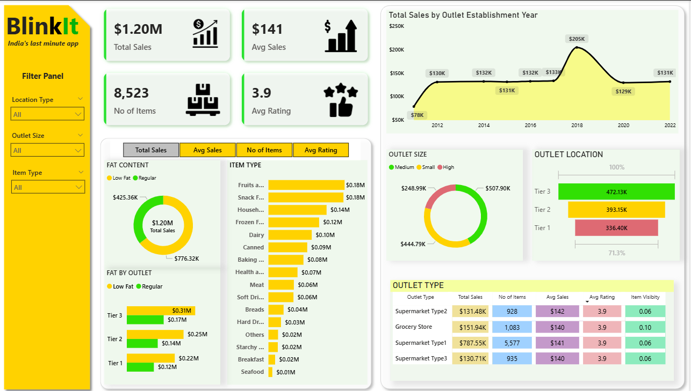
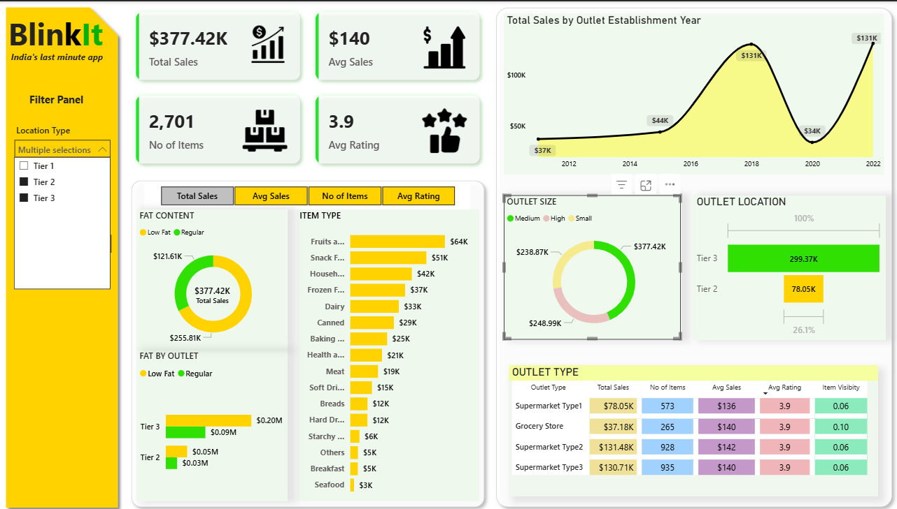

# Blinkit Data Analytics Project 📊  

## 📌 Project Overview  
This project analyzes **Blinkit’s business performance** using SQL and Power BI.  
The goal is to uncover insights on **sales trends, customer behavior, and product performance**, and present them in an interactive dashboard.  

---

## 🛠️ Tools & Technologies Used  
- **SQL** → Data extraction & transformation  
- **Power BI** → Data visualization & dashboarding  
- **Excel/CSV** → Data source  

---

## 📊 Dashboard Preview  
Main Dashboard:  

Additional View:  

---

## 📊 Dashboard
PowerBI Dashboard -->[Click_here](data_analysis/DASHBOARD/BlinkIt.pbix)

---

## 📑 SQL Queries  
The SQL queries used for cleaning, transforming, and analyzing data are available [here](data_analysis/SQL_QUERIES/blinkit_data_script.sql).  

---

##  📑 SQL Queries 
The explanation and query that is used to perform data analysis are available [here](data_analysis/SQL_QUERIES/sql_analysis_txt).

---
  📈 Key Insights

Top-performing products and categories

Customer purchasing patterns

Revenue trends over time

Business KPIs for decision-making

🔮 Future Improvements

Automating data refresh with SQL Server

Adding predictive analytics for sales forecasting

Enhancing dashboard with more drill-through analysis

👤 Author : Aravindh Babu

📧 Email: aravindhbabu12@gmail.com

🔗 LinkedIn:www.linkedin.com/in/aravindh-babu-3a6341295

 | GitHub : AravindhBabu123

 Thank you!!
